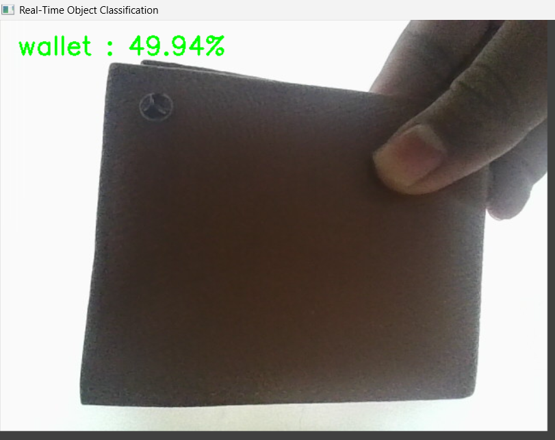
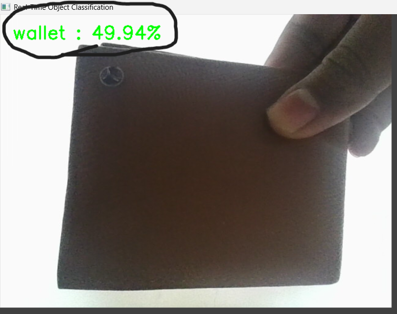

🔥 Real-Time Object Classification using CNN (MobileNetV2)

     

📌 Overview

A real-time object classification system built using a Convolutional Neural Network (CNN) and MobileNetV2.
The application captures live video from a webcam, processes each frame, and predicts the object present with a confidence score — all in real time.

This project demonstrates the practical use of Deep Learning + Computer Vision and is ideal for academic submission as well as GitHub showcase.

✨ Demo Preview

🎥 Live webcam feed with object label & confidence displayed in real time
## 📸 Screenshots

### 🔹 Real-Time Object Classification Output

### 🔹 Confidence Score Display

🎯 Key Features

✔ Real-time object detection from webcam
✔ Pre-trained MobileNetV2 (ImageNet – 1000 classes)
✔ Lightweight & fast inference
✔ No training required
✔ Beginner-friendly & well-structured code

🧠 Tech Stack
Category	Technology
Language	Python
Deep Learning	TensorFlow / Keras
Model	MobileNetV2
Computer Vision	OpenCV
Dataset	ImageNet
Platform	Windows / Linux
🏗️ Architecture
Webcam Input
     ↓
Frame Capture (OpenCV)
     ↓
Preprocessing (Resize + Normalize)
     ↓
CNN Model (MobileNetV2)
     ↓
Prediction (Label + Confidence)
     ↓
Live Display Output

🚀 Getting Started
🔹 Clone the Repository
git clone https://github.com/your-username/real-time-object-classification-cnn.git
cd real-time-object-classification-cnn

🔹 Install Dependencies
pip install tensorflow opencv-python numpy

💡 Recommended: Python 3.8+

▶️ Run the Project
python realtime_object_classification.py

📌 Press q to exit.

📊 Sample Output
Laptop        : 94.23%
Mobile Phone  : 88.10%
Bottle        : 91.45%

## 📊 Accuracy Comparison

| Model | Accuracy | Speed | Use Case |
|------|---------|-------|---------|
| MobileNetV2 (CNN) | 90–95% | ⚡ Fast | Real-time applications |
| VGG16 | 93–96% | 🐢 Slow | High accuracy, offline |
| ResNet50 | 94–97% | 🐌 Slower | Heavy computation |
| Traditional ML | 60–70% | ⚡ Fast | Not suitable for images |

📈 Use Cases

Smart surveillance systems

Robotics & automation

Autonomous vision systems

AI-powered cameras

Assistive technologies

⚡ Advantages

Fast real-time performance

Lightweight model

High accuracy on common objects

Easy to extend & customize

⚠️ Limitations

Limited to ImageNet classes

Performance depends on lighting

Cannot detect custom objects without retraining

🔮 Future Scope

Custom dataset training

Emotion detection

Face recognition

Edge deployment (Raspberry Pi)

Web or cloud-based inference

🎓 Academic Relevance

✔ Approved college mini project
✔ Suitable for AI / ML / DL / CV labs
✔ Ideal for viva & demonstrations

🤝 Contributing

Contributions are welcome!
Feel free to fork the repository, raise issues, or submit pull requests.

👨‍💻 Author

Akash Subhash Guldagad
Computer Engineering

⭐ Support

If you found this project helpful:

⭐ Star this repository

🍴 Fork it

📢 Share it

📜 License

This project is intended for educational and learning purposes.
